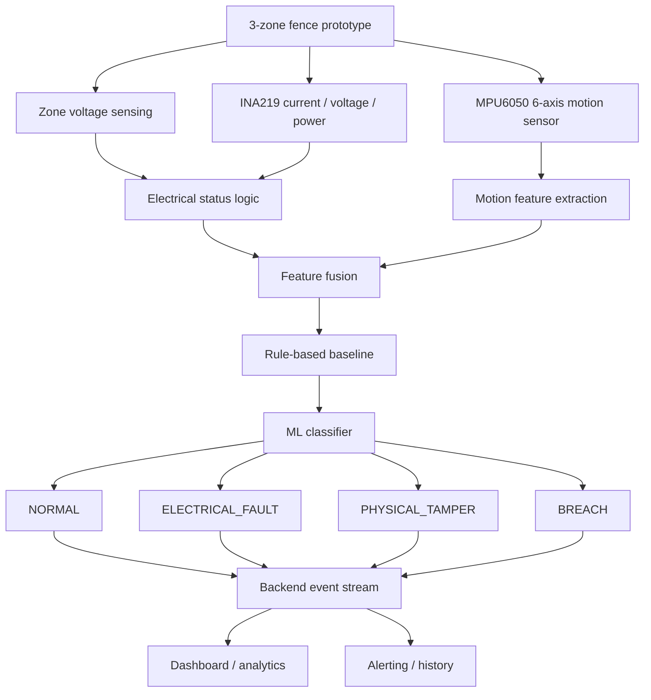

# System Architecture

## Objective

FENCEGUARD-X is a safe low-voltage perimeter monitoring prototype that combines:
- zone-wise electrical integrity monitoring
- current and power monitoring
- 6-axis physical motion sensing
- temporal event analysis
- sensor-fusion event classification
- zone-specific alerting and backend event logging

## Safety boundary

This prototype is intentionally safe and low voltage. It is not a real high-voltage electric fence. No dangerous high-voltage circuitry is part of the design or recommended workflow.

## High-level architecture

## Current implementation status

### Implemented and verified in repository
- 3-zone electrical sensing architecture is present in project documentation
- real baseline data exists in `data/raw/tamper_experiments/EXP_01_NORMAL_STATIONARY.csv`
- the electrical detection layer can identify open/cut and short behavior by zone

### In progress or pending
- motion feature extraction pipeline
- sensor fusion classifier
- backend event integration
- dashboard and alerting flow
- ML training and evaluation on real experimental data

## Layered responsibilities

### Hardware layer
- ESP32 controller
- 3 independent fence zones
- INA219 bus voltage/current/power
- MPU6050 motion sensor

### Firmware layer
- consistent sampling
- raw CSV logging
- sensor validation
- time-stamped event capture
- no ML inference on the microcontroller until the feature pipeline is validated

### ML layer
- data validation
- session handling
- feature engineering
- visualization and class balance checks
- Random Forest baseline first
- recall monitoring for tamper and breach classes

### Backend layer
- receive event streams
- store sensor readings and alerts
- expose API for status, zone state, analytics, and history

### Frontend layer
- visualize status by zone
- show global system state
- display event history and confidence

## Key design note

The strongest innovation is not simply “voltage detection” but the combined interpretation of:
- per-zone electrical integrity
- current and power abnormalities
- movement and vibration signatures
- event timing and context
- fusion-based classification into normal, electrical fault, physical tamper, and breach states

## TODO

- [TODO] Formalize event schema for fused outputs.
- [TODO] Add real motion and tamper datasets.
- [TODO] Train supervised ML classifiers with real data.
- [TODO] Verify recall for tamper and breach detection.
- [TODO] Complete backend and dashboard integration.
